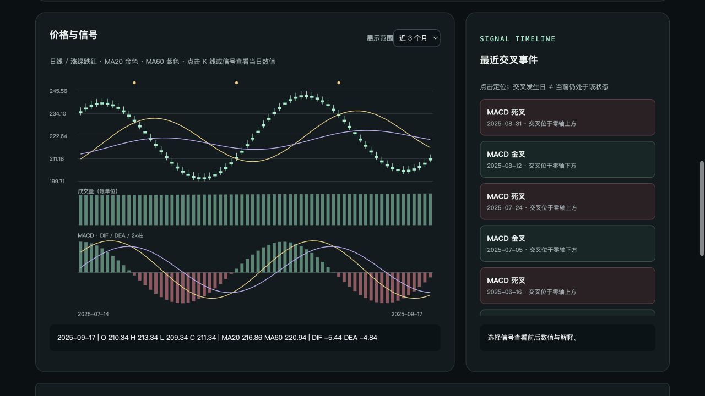

# Snap Stock

> 看懂走势，不止看见指标。

输入 A 股、美股或港股代码，通过图表和大白话解读了解近期走势。**不是荐股或收益预测工具。**



截图为历史验收结果，非实时行情。

## 功能

- **图表与信号**：K 线、均线、MACD、成交量；点击金叉/死叉查看数值依据。
- **技术分析**：RSI、ATR、20/60 日高低点，解释涨跌力度、波动和价格位置。
- **市场对比**：对照沪深 300、标普 500 或恒生指数，查看个股相对强弱。
- **通俗解读**：现在怎么看、为什么、接下来观察什么；默认 DeepSeek，无 Key 或调用失败时回退规则解读。
- **可追溯**：展示数据来源、截至日期和模型引用事实，支持导出 JSON。

## 快速开始

需要 Node.js 22+，Windows / macOS / Linux 通用：

```sh
npm ci
npm start
```

访问 http://localhost:3100 。示例：A 股 `600519`、美股 `AAPL`、港股 `00700`。

可将 `.env.example` 复制为 `.env`，按需配置，修改后重启：

| 变量 | 用途 |
| --- | --- |
| `DEEPSEEK_API_KEY` | 启用模型解读；不填仍可使用规则分析 |
| `DATA_PROXY_URL` | 行情连接失败或 403 时，设置可用的 HTTP 代理 |
| `PORT` | 服务端口，默认 `3100` |

其他模型设置见 `.env.example`。不要提交 `.env`；模型无法替代缺失的真实行情。

## 使用边界

- 使用 Yahoo Finance 非官方接口，可能限流或缺失；日线保守排除交易所当地今天，不是实时服务。
- 指标基于源复权历史价格，至少需 120 根有效日线；不同平台的复权与计算口径可能不同。
- 指数数据异常时仅保留个股分析；当前沪深 300 源存在空值，可能无法展示 A 股市场背景。
- 尚未接入新闻、公告和财报日历；模型引用校验不保证解释绝对正确，技术信号不保证未来走势。
- 仅作个人学习用途，数据使用须另行核对许可；服务无鉴权，勿直接开放公网。

## 开发与文档

`npm run dev` 启动开发模式，`npm test` 运行离线单元测试。

[设计与计算口径](docs/DESIGN.md) · [测试报告](docs/TEST_REPORTS.md) · [MIT License](LICENSE)

软件许可证不包含行情数据授权。
